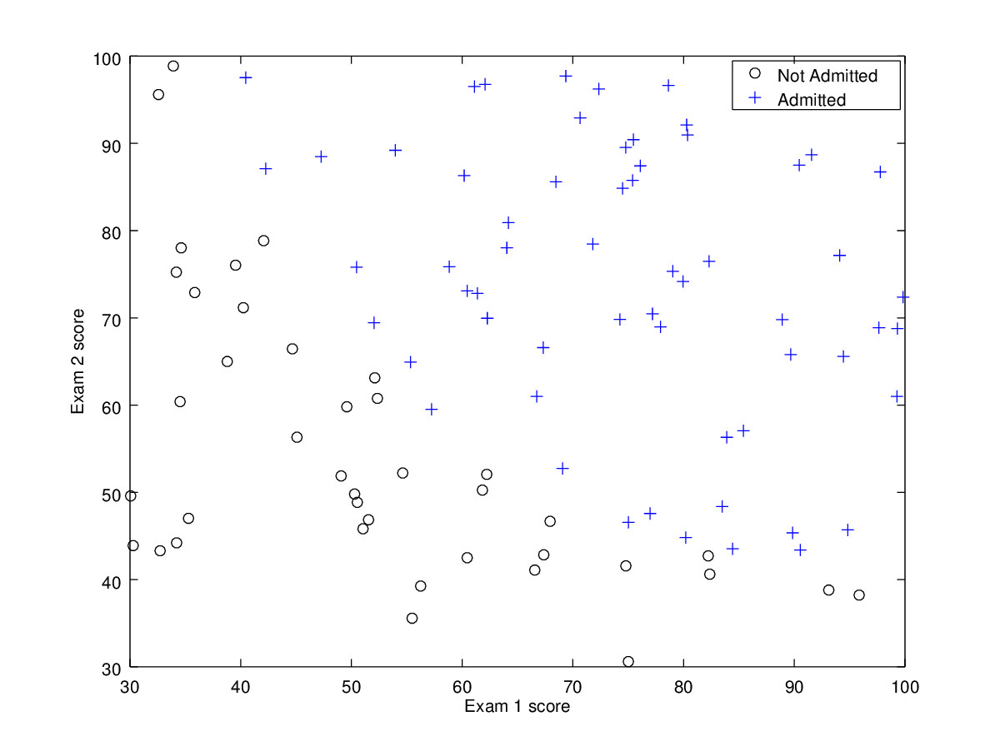
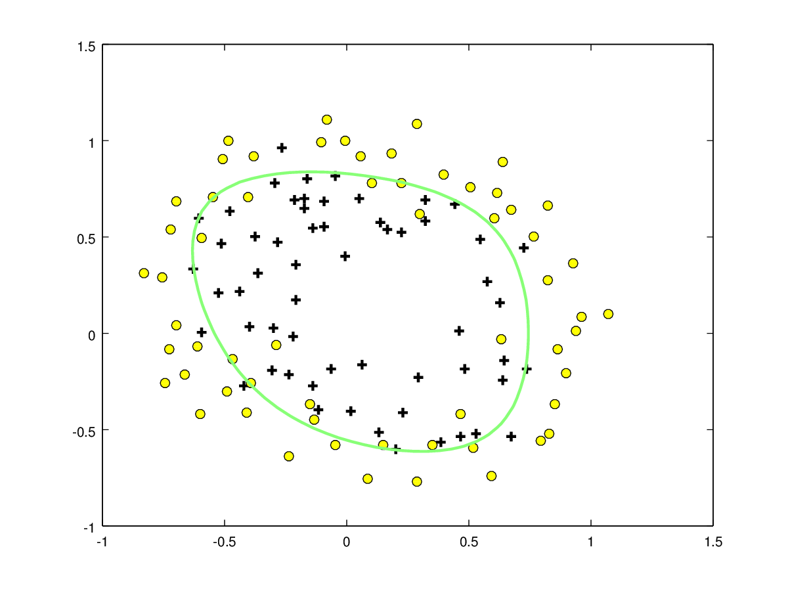
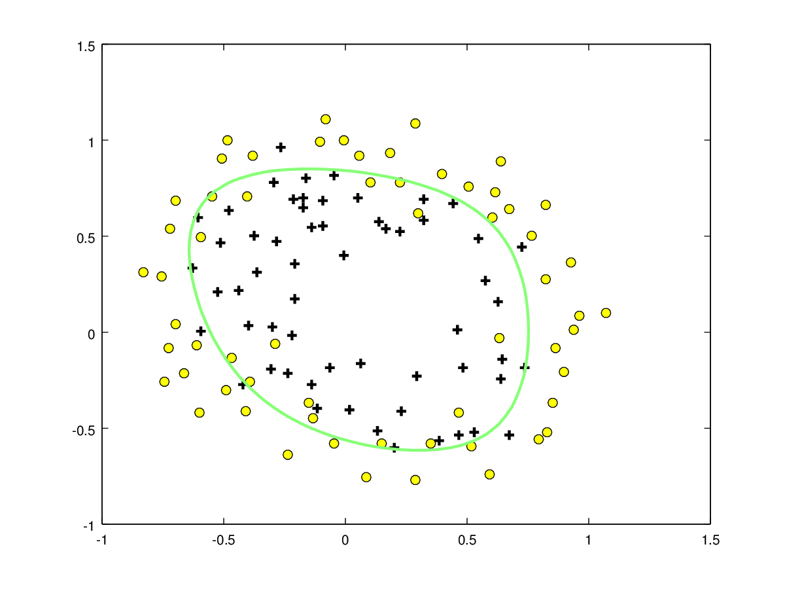
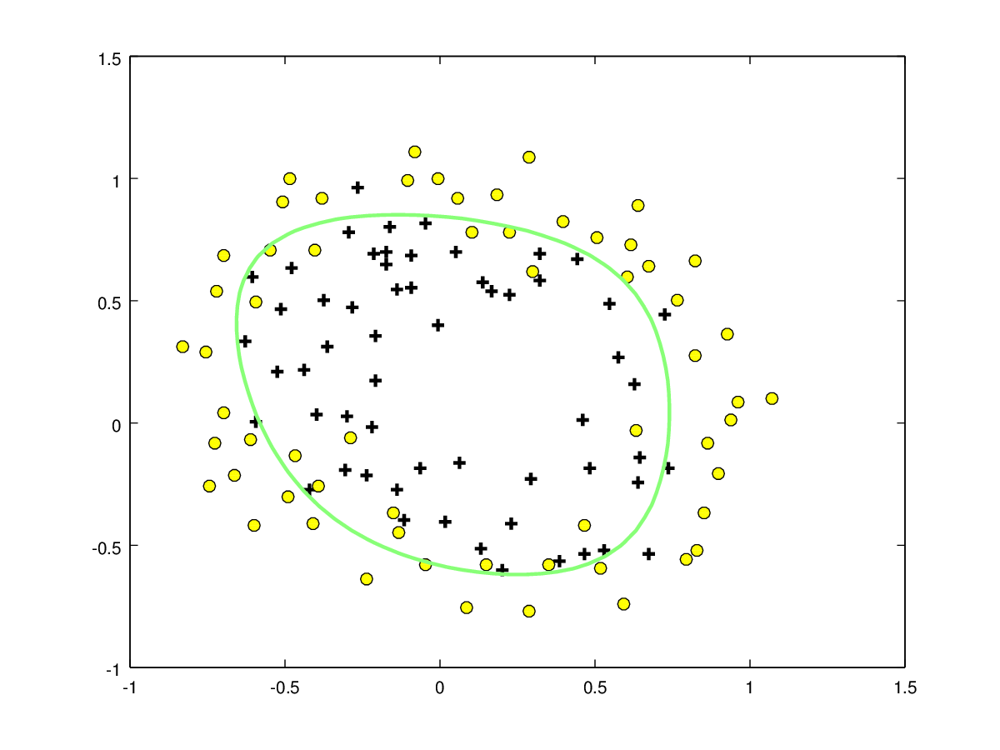
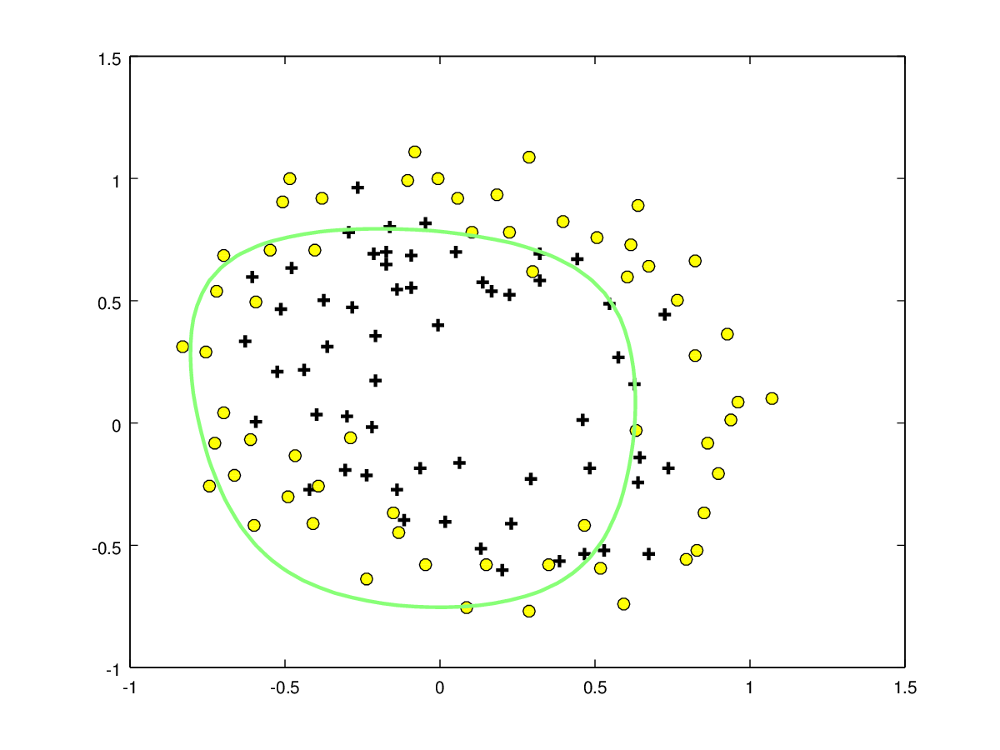
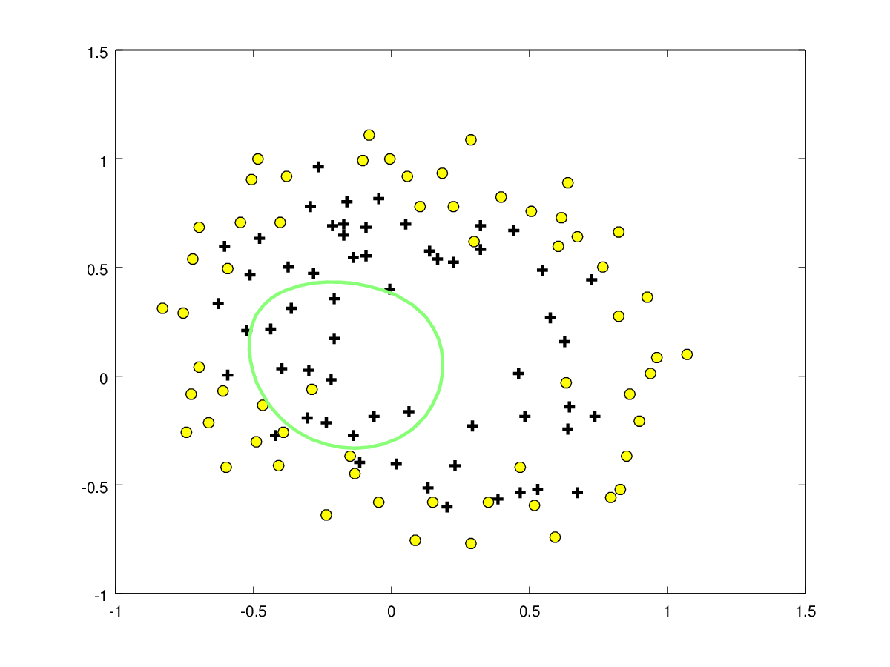

Visualización
-----------------
Para poder visualizar los ejemplos de entrenamiento, se ha desarrollado el siguiente algoritmo:

```matlab
  function visualize_examples(examples)
    y = examples(:, 3);
    negatives = find(y == 0);
    positives = find(y == 1);
    plot(examples(negatives, 1), examples(negatives, 2), \
      'ko', examples(positives, 1), examples(positives, 2), \
      '+', 'MarkerFaceColor', 'y', 'MarkerSize', 7);
    xlabel('Exam 1 score', 'fontsize', 10);
    ylabel('Exam 2 score', 'fontsize', 10);
    legend('Not Admitted', 'Admitted');
  endfunction
```

Toma la matriz de ejemplos cargada directamente a Octave. A continuación se encuentra una llamada de ejemplo, con el resultado incluido en la Figura 1.

```matlab
  examples = load('files/ex2data1.txt');
  visualize_examples(examples);
```



Regresión Logística
-------------------------
Teniendo en cuenta los datos provistos en el archivo `ex2data1.txt`, se ha desarrollado un algoritmo para predecir si un estudiante será admitido en la universidad o no, basándonos en las calificaciones obtenidas en dos exámenes.

### Función sigmoide

Para asistir en el cálculo de hipótesis se ha desarrollado una función sigmoide, la cual genera un valor entre 0 y 1, y funciona tanto para matrices como para elementos independientes:

```matlab
  function R = sigmoid(X)
    R = 1 ./ (1 .+ e .^ (-X));
  endfunction
```

### Función de coste y gradiente

Es necesario desarrollar una función de coste que, dados los ejemplos y un vector de thetas, devuelva el coste y la gradiente en ese punto. Para facilitar los cálculos, se ha decidido extender el vector de thetas para que coincida con las dimensiones de los ejemplos de entrenamiento (matriz X). Esto facilita el uso de la función `dot` para calcular el valor a pasar a la función sigmoide en el cálculo de las hipótesis. A continuación se incluye el código de la función:

```matlab
  function [J, grad] = cost(theta, X, y)
    extended_theta = repmat(theta, rows(X), 1);
    hypotheses = sigmoid(dot(extended_theta, X, 2));
    positive_hypotheses = y.*log(hypotheses);
    negative_hypotheses = (1 - y).*log(1 - hypotheses);
    J = 1/rows(X) * sum(-positive_hypotheses - negative_hypotheses);
    grad = arrayfun(@(col_index) (1/rows(X) * sum((hypotheses - y) .* X(:, col_index))), 1:columns(X));
  endfunction
```

### Cálculo del valor óptimo de theta

Con la función de coste completada, es posible utilizar la función `fminunc` para que calcule automáticamente los valores óptimos de theta. A continuación se puede llamar a la función `plotDecisionBoundary` para que muestre la frontera de decisión creada.El resultado se muestra en la Figura 2:

```matlab
  examples = load('files/ex2data1.txt');
  visualize_examples(examples);

  % Cargar y extender el vector de ejemplos para dar cabida a theta_0
  X = [ones(rows(examples), 1) examples(:, 1:2)];

  % Resultados de los ejemplos
  y = examples(:, 3);

  % Inicializar el vector de thetas conforme a X
  initial_thetas = zeros(1, columns(X));

  % Configurar las opciones para llamar a fminunc
  options = optimset('GradObj', 'on', 'MaxIter', 400);

  % Encontrar los valores de theta óptimos
  [thetas, total_cost] = fminunc(@(t) (cost(t, X, y)), initial_thetas, options);

  % Mostrar la frontera de decisión
  plotDecisionBoundary(thetas, X, y);
```


También se puede desarrollar una función que cuente el número de ejemplos que son clasificados correctamente con esta frontera.

```matlab
  function correct = count_guesses(thetas, X, y)
    extended_thetas = repmat(thetas, rows(X), 1);
    guesses = sigmoid(dot(extended_thetas, X, 2));
    guesses_no = guesses(:, 1) < 0.5;
    guesses_yes = guesses(:, 1) >= 0.5;
    correct = rows(find(y(guesses_yes, 1) == 1)) + rows(find(y(guesses_no, 1) == 0));
  endfunction
```

Regularización
----------------

Para conseguir fronteras no-lineales se ha utilizado la función mapFeature para aumentar el número de dimensiones de X.

A continuación, se ha ampliado la función `count` para que tenga en cuenta estas nuevas dimensiones, y regularize los atributos:

```matlab
  function [J, grad] = cost_multiple(theta, X, y, lambda)
    [J_base, grad_base] = cost(theta, X, y);
    J = J_base + (lambda /  2 * rows(X)) * sum(theta);
    grad_thetas = (lambda / rows(X)) .* theta;
    grad_thetas(1, 1) = 0;
    grad = grad_base + grad_thetas;
  endfunction
```

Además se ha introducido el parámetro `lambda`, el cual permite controlar el efecto de cada parámetro en la regularización. Siguiendo un proceso similar al anterior, obtenemos la siguiente secuencia de llamadas:

```matlab
  examples = load('files/ex2data2.txt');
  visualize_examples(examples);

  X = [ones(rows(examples), 1) examples(:, 1:2)];

  % Extender X para añadir parámetros a la entrada
  X_extended = mapFeature(examples(:, 1), examples(:, 2));

  y = examples(:, 3);
  initial_thetas = zeros(1, columns(X_extended));

  % Puede ser configurado a mano
  initial_lambda = 1;

  options = optimset('GradObj', 'on', 'MaxIter', 400);

  % Cambio cost -> cost_multiple
  [thetas, total_cost] = fminunc(@(t) (cost_multiple(t, X_extended, y, initial_lambda)), initial_thetas, options);

  plotDecisionBoundary(thetas', X_extended, y);
```

A continuación se incluye una tabla con los diferentes resultados de invocar este código con los datos de `ex2data2.txt`, variado únicamente el parámetro `initial_lambda`. Como se puede observar, los mejores resultados ocurren con valores pequeños, y con `initial_lambda = 100` se puede apreciar claramente el sobreajuste.

| Valor de lambda | Resultado     |
| :------------- | :------------- |
|  `0.1`       |        |
|  `0.5`       |        |
|  `1`       |        |
|  `5`       |        |
|  `10`       |        |
|  `100`       |        |
